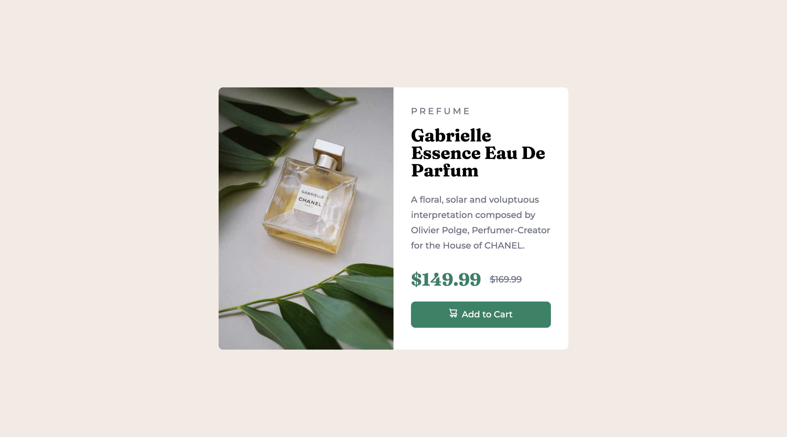

# Frontend Mentor - Product preview card component solution

This is a solution to the [Product preview card component challenge on Frontend Mentor](https://www.frontendmentor.io/challenges/product-preview-card-component-GO7UmttRfa). Frontend Mentor challenges help you improve your coding skills by building realistic projects.

## Table of contents

- [Overview](#overview)
  - [The challenge](#the-challenge)
  - [Screenshot](#screenshot)
  - [Links](#links)
- [My process](#my-process)
  - [Built with](#built-with)
  - [What I learned](#what-i-learned)
  - [Continued development](#continued-development)
  - [Useful resources](#useful-resources)
- [Author](#author)

## Overview

This was a fun project to work on.
Pretty much all CSS with some necessary semantic HTML.
I started with desktop and worked it into mobile. No frameworks or libraries used just regular HTML and CSS

### The challenge

Users should be able to:

- View the optimal layout depending on their device's screen size
- See hover and focus states for interactive elements

### Screenshot

You can see other screenshots in the screenshot folder.

### Links

- Solution URL: [github Repo](https://github.com/calebmcmains/fm-product-preview-card.git)
- Live Site URL: [Github Page](https://calebmcmains.github.io/fm-product-preview-card/)

## My process

My process was simple.

- spent time creating CSS variables from looking at the design pages visually
- write out the HTML
- style for desktop with custome CSS properties
- move down in screen size and adjust using media queries

### Built with

- Semantic HTML5 markup
- CSS custom properties
- Flexbox
- CSS Grid
- Desktop-first workflow

### What I learned

I learned that even something as simple as a product card here can have its challenges.

### Continued development

One thing I know I need to work on is when to use defined width and dynaimic widths. For this project a fixed width was best. Over all though its been trial and error for me on using fixed vs dynamic width properties. I need to get better at knowing when to use which.

I also need help with psudo elements. I wanted the cart icon to be a psudo element but had trouble getting it align center with the text vertically. Instead the wheel kept staying inline with the bottom of the text. Any feedback is welcome.

### Useful resources

- [Google](https://www.google.com) - Google is amazing. Once you learn how to google. Your ability to develope grows. No one memorizes everything, but developing th skill of googling what you need is invaluable.

## Author

- Website - [Caleb McMains](https://www.calebmcmains.com)
- Frontend Mentor - [@calebmcmains](https://www.frontendmentor.io/profile/calebmcmains)
